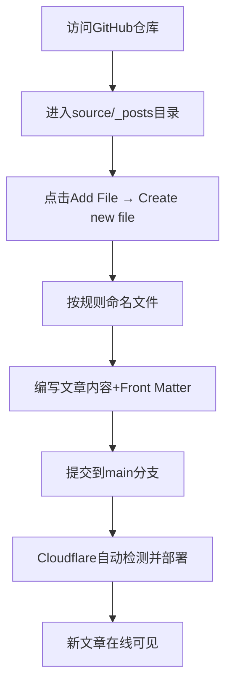

完全理解！在GitHub上创建新博客文章而不是修改原有文件，操作非常简单。以下是详细步骤：

## 📝 在GitHub上创建新博客文章的步骤

### 第一步：进入您的博客仓库
1. 访问：`https://github.com/userhanhan/blog-hexo`
2. 确保您已登录GitHub账户

### 第二步：进入文章目录
1. 点击进入 `source` 文件夹
2. 点击进入 `_posts` 文件夹

### 第三步：创建新文章文件
1. 点击右上角的 **"Add file"** 按钮
2. 选择 **"Create new file"**

### 第四步：命名新文件
在文件名输入框中，按照Hexo的命名规则：
```
YYYY-MM-DD-文章标题.md
```
例如：
```
2025-01-20-my-new-blog.md
```

### 第五步：编写文章内容
在编辑器中输入以下格式的内容：

````markdown
---
title: 我的新博客文章标题
date: 2025-01-20 12:00:00
tags: [标签1, 标签2]
categories: [分类名称]
---

这里是您的博客文章内容，使用Markdown语法编写。

## 二级标题
这是段落内容。

- 列表项1
- 列表项2

```python
# 代码块示例
print("Hello, World!")
```
````

### 第六步：提交新文件
1. 滚动到页面底部
2. 在 **"Commit new file"** 部分：
   - 第一行：`Add new post: 我的新博客文章标题`
   - 可选描述：（可以留空）
3. 选择 **"Commit directly to the main branch"**
4. 点击 **"Commit new file"**

## 🔄 完整流程示意图



## ⚠️ 重要注意事项

### 文件名规则
- **必须包含日期**：`YYYY-MM-DD-标题.md`
- **使用连字符** 而不是空格
- **扩展名必须为 `.md`**

### Front Matter格式（文件开头的配置）
```yaml
---
title: 您的文章标题
date: 年-月-日 时:分:秒
tags: [标签1, 标签2, 标签3]
categories: [分类名称]
---
```

### 等待自动部署
- 提交后，Cloudflare通常需要 **2-5分钟** 检测变更并重新部署
- 您可以在Cloudflare Pages的部署日志中查看进度
- 部署完成后，新文章会自动出现在您的博客中

## 💡 实用技巧

### 快速复制模板
您可以先打开现有的 `hello-world.md` 文件，点击"Raw"查看原始内容，然后复制Front Matter结构。

### 使用描述性文件名
好的文件名示例：
- `2025-01-20-getting-started-with-hexo.md`
- `2025-01-20-my-first-blog-post.md`

### 测试部署
创建新文章后，您可以：
1. 访问您的博客首页查看新文章列表
2. 点击文章标题查看完整内容
3. 检查格式是否正确显示

现在就去尝试创建您的第一篇新文章吧！如果有任何问题，请随时告诉我。
